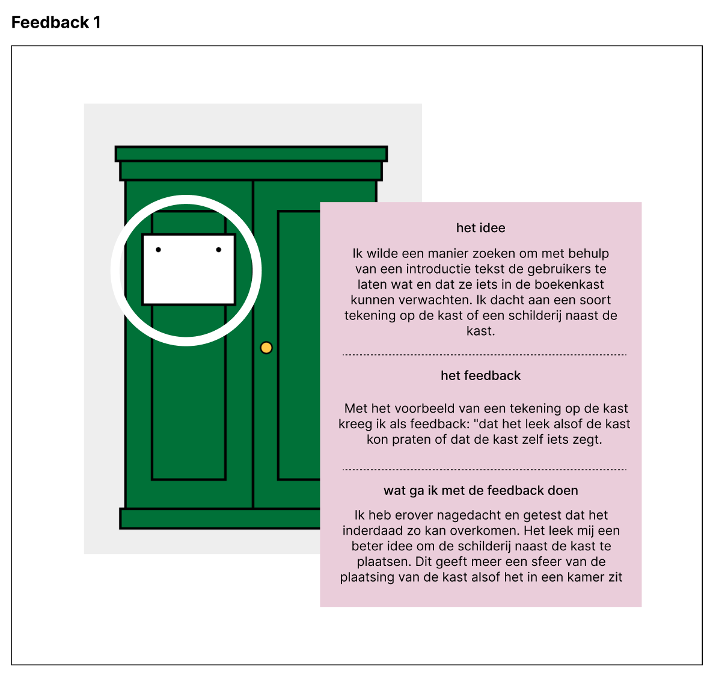
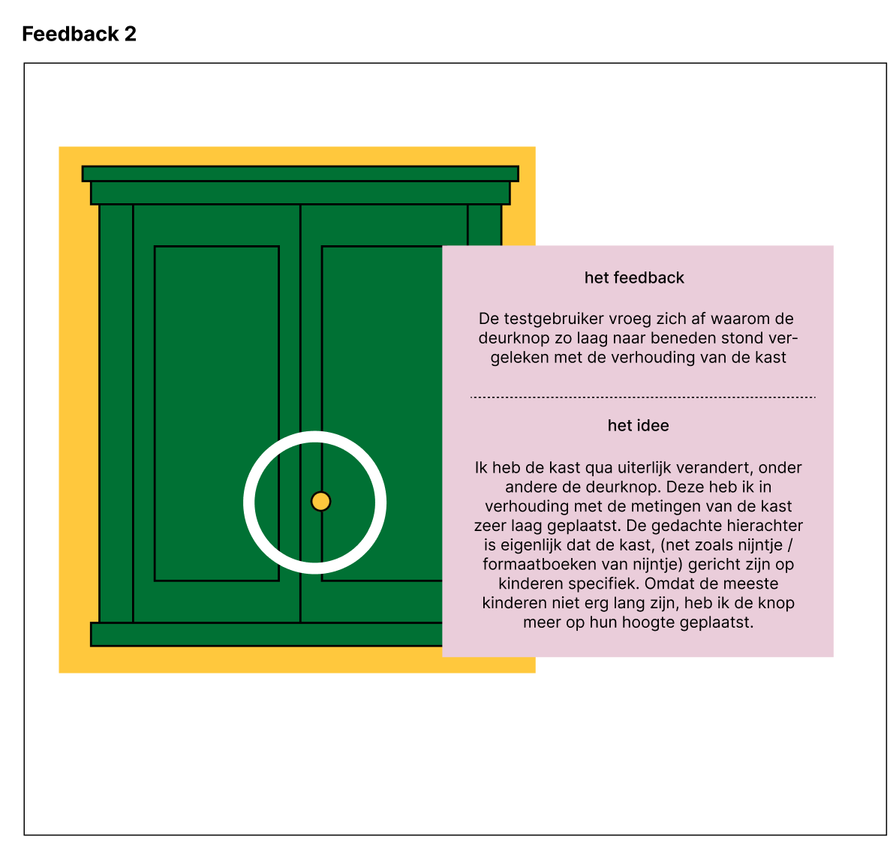
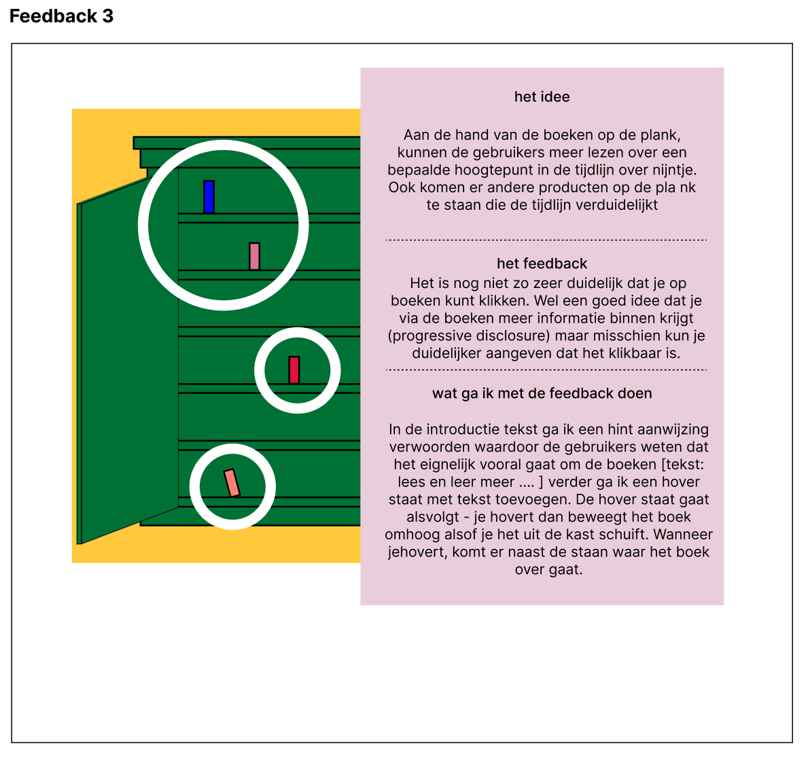
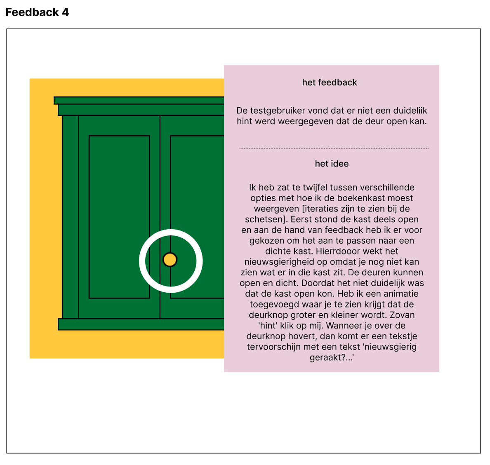
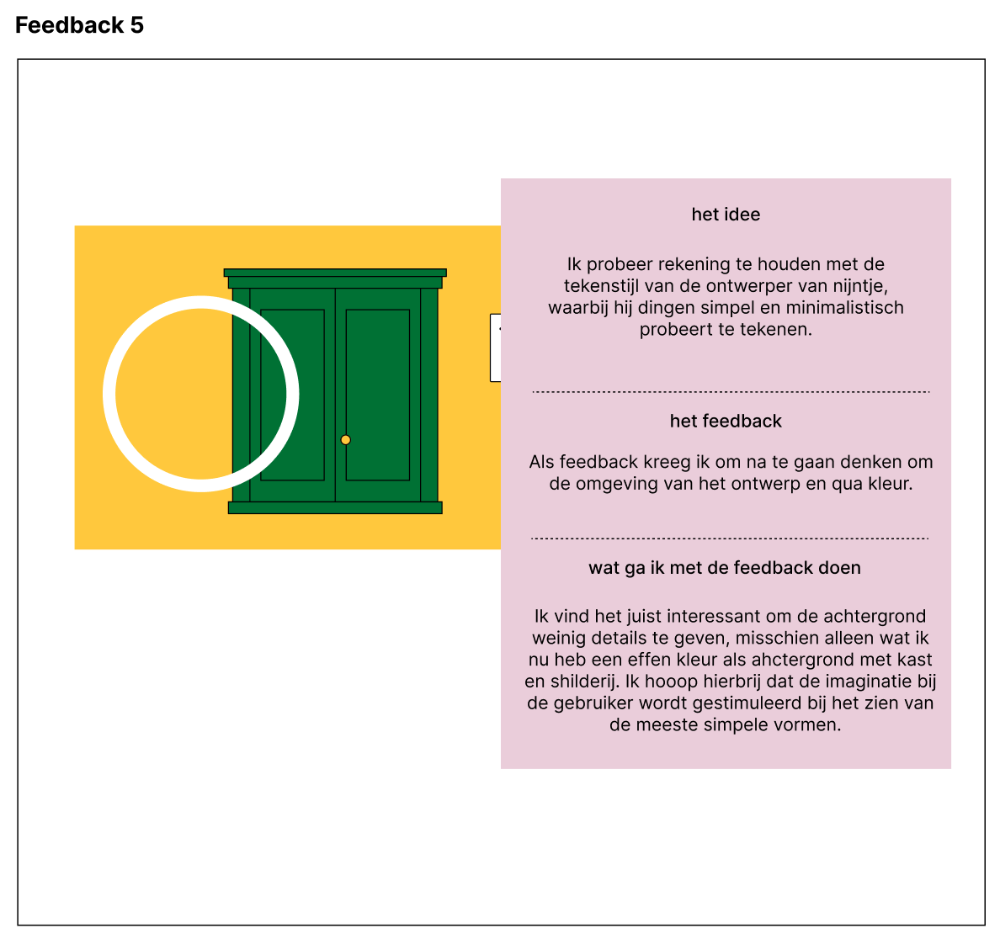

# Procesverslag
Markdown is een simpele manier om HTML te schrijven.  
Markdown cheat cheet: [Hulp bij het schrijven van Markdown](https://github.com/adam-p/markdown-here/wiki/Markdown-Cheatsheet).

Nb. De standaardstructuur en de spartaanse opmaak van de README.md zijn helemaal prima. Het gaat om de inhoud van je procesverslag. Besteedt de tijd voor pracht en praal aan je website.

Nb. Door *open* toe te voegen aan een *details* element kun je deze standaard open zetten. Fijn om dat steeds voor de relevante stuk(ken) te doen.

## Jij

### Ontwerper:
Emy Nguyen

#### Je startniveau:
Mijn startniveau is: is erg matig, namelijk blauw (misschien lichtblauw, een beetje eronder)

# Je plan

  
De eerste versie/schets van je ontwerp & je persoonlijke uitdaging

  ### De eerste versie/schets:
  

  ### Je ambitie: 
  Aan deze technieken/punten wil ik werken:
  - Kennis maken met javascript om 
  - punt 2
  - nog een punt
  - ...
 

## Voortgang/Feedback 1

  
Mijn bevindingen + wijzigingen (minimaal 5)

  
  

  ### Bevinding 1 [afbeelding met feedback verwerkt]:
  

  ### Bevinding 2 [afbeelding met feedback verwerkt]:
  

  ### Bevinding 3 [afbeelding met feedback verwerkt]:
  

  ### Bevinding 4 [afbeelding met feedback verwerkt]:
  

  ### Bevinding 5 [afbeelding met feedback verwerkt]:
  

## Voortgang/Feedback 2

  
Mijn bevindingen + wijzigingen (minimaal 5)

  
  ### Bevinding 1:
  Omschrijving van wat er nog niet orde was (tekst en afbeeding(en)).

  #### oplossing:
  Beschrijving hoe je het hebt hebt opgelost of als het niet gelukt is hoe je het zou oplossen (tekst en afbeeding(en)).

  ### Bevinding 2:
  Omschrijving van wat er nog niet orde was (tekst en afbeeding(en)).

  #### oplossing:
  Beschrijving hoe je het hebt hebt opgelost of als het niet gelukt is hoe je het zou oplossen (tekst en afbeeding(en)).

  ### Bevinding 3:
  ...

## Voortgang/Feedback 3

  
Mijn bevindingen + wijzigingen (minimaal 5)

  
  ### Bevinding 1:
  Omschrijving van wat er nog niet orde was (tekst en afbeeding(en)).

  #### oplossing:
  Beschrijving hoe je het hebt hebt opgelost of als het niet gelukt is hoe je het zou oplossen (tekst en afbeeding(en)).

  ### Bevinding 2:
  Omschrijving van wat er nog niet orde was (tekst en afbeeding(en)).

  #### oplossing:
  Beschrijving hoe je het hebt hebt opgelost of als het niet gelukt is hoe je het zou oplossen (tekst en afbeeding(en)).

  ### Bevinding 3:
  ...

## Reflectie

  
Mijn eindresultaat & persoonlijke ontwikkeling

  ### Je uitkomst - karakteristiek screenshot(s):
  

  ### Dit ging goed/Heb ik geleerd: 
  Korte omschrijving met plaatje(s)

  

  ### Dit was lastig/Is niet gelukt:
  Korte omschrijving met plaatje(s)
  Wat ik erg lastig vond is vooral het onderzoeken, kijken en proberen van 

  

## Bronnenlijst

continu bijhouden terwijl je werkt

Nb. Wees specifiek ('css-tricks' als bron is bijv. niet specifiek genoeg).

1. bron 1
2. bron 2
3. ...

